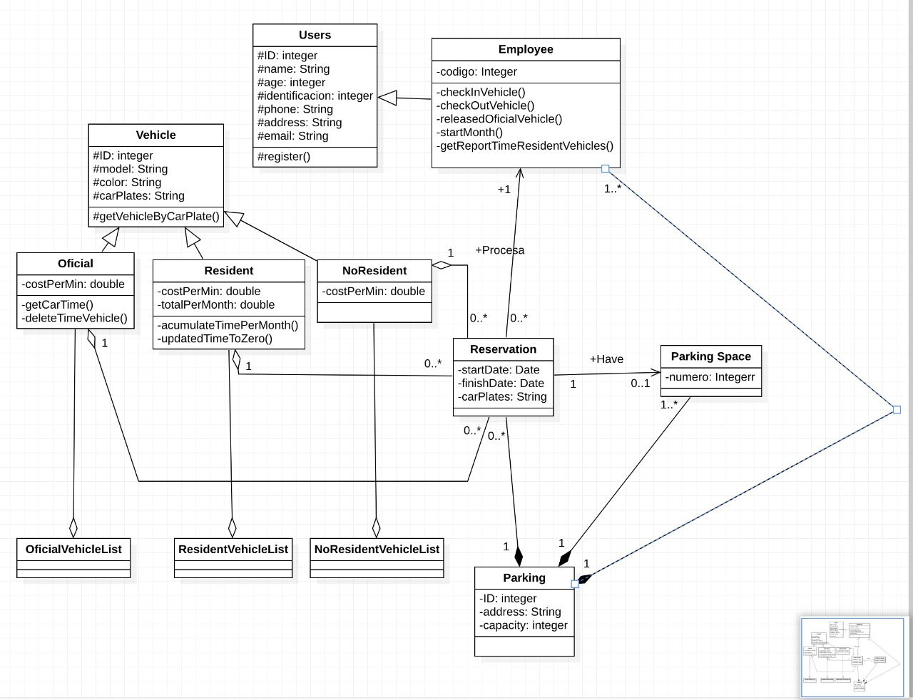
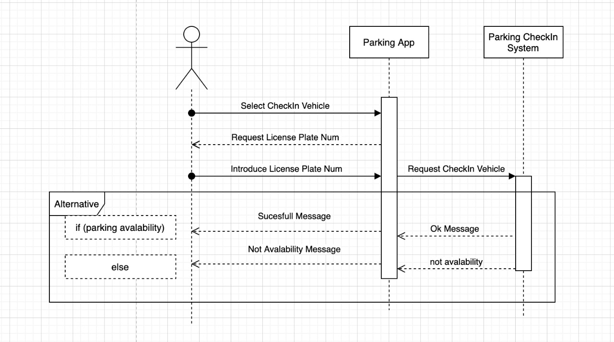
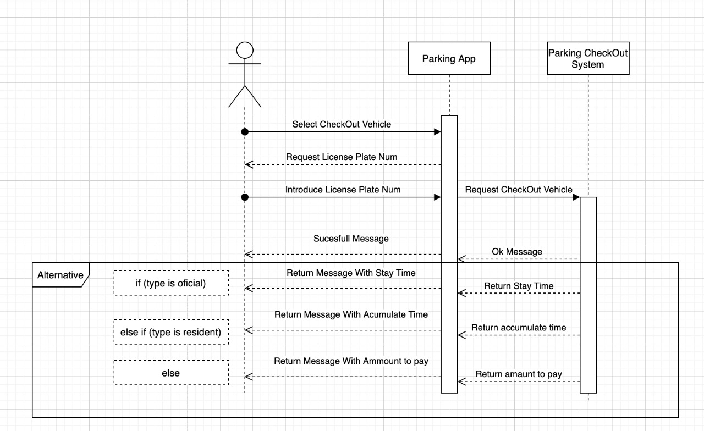
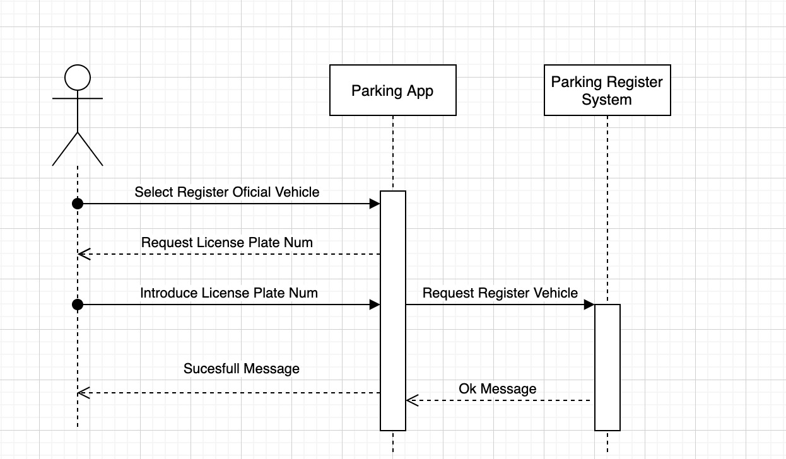
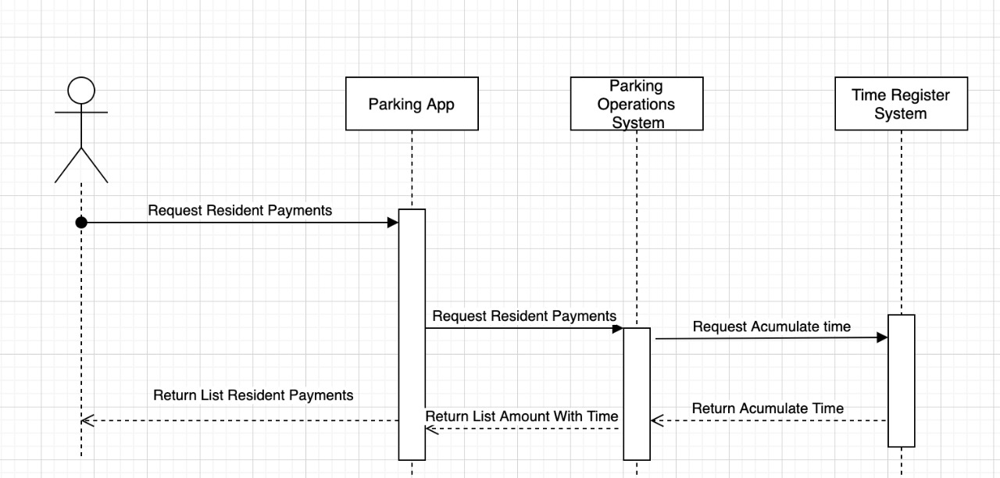
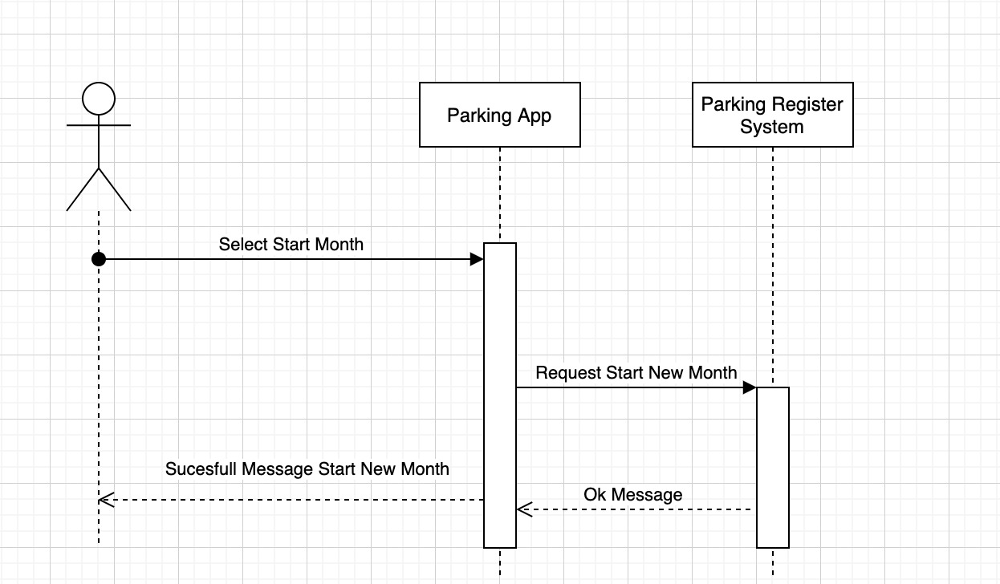

# Parking System

## Previous requirements

### Nodejs and npm

Install [Nodejs](https://nodejs.org/es/) recomended the LTS version

### Env

.env.example you can find a example about your .env on your proyect

## Finish Points

- Diagrama de clases y diagrama.
  

- Diagrama de secuencia de las partes encargadas de la
  aplicación.
  

## Not Finish Points
